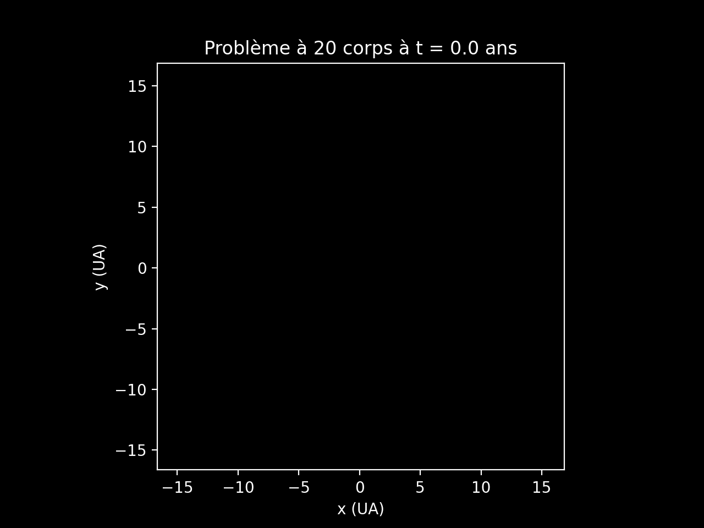
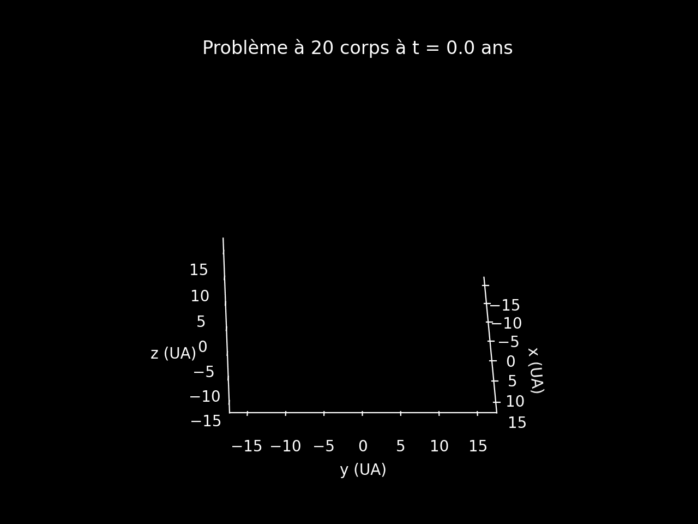

#  ⚛️ N-Body Gravitational Simulation

| 2D | 3D |
|:--:|:--:|
|  |  |

---
Numerical simulation of the N-body gravitational problem in 2D and 3D.
Solves the coupled ODE system using `scipy.integrate.solve_ivp` with configurable
integrators, collision detection, and animated visualization.

CentraleSupélec Coding Weeks — Group 17.

## Usage

```bash
pip install -r requirements.txt

# Run simulation (opens matplotlib animation)
python main.py                        # 5 bodies, 2D
python main.py --dim 3 --bodies 10    # 10 bodies, 3D
python main.py --bodies 8 --t_max 20 --method DOP853

# Run experiments (saves CSVs + plots to results/)
python main.py -e all
python main.py -e energy_conservation
python research.py -e scaling_benchmark
```

## Project structure

```
main.py              CLI entry point
physics.py           ODE system, solver, collision detection, initial conditions
visualization.py     2D and 3D matplotlib animations
research.py          Experiment framework (energy, convergence, scaling, stability, ...)
requirements.txt
```

## Experiments

energy_conservation, solver_comparison, collision_stats, 2d_vs_3d,
softening_sensitivity, timestep_convergence, mass_distribution,
angular_momentum, scaling_benchmark, trajectory_stability
